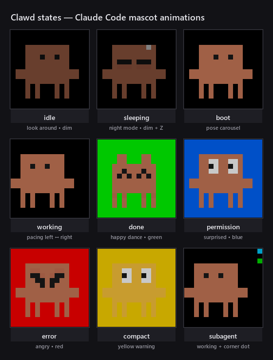
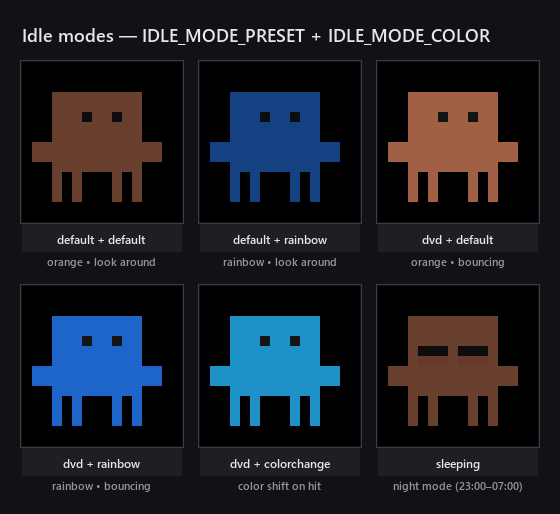

# clawd-matrix

Real-world notifications for [Claude Code](https://docs.claude.com/en/docs/claude-code) using a smart light and a 16×16 LED matrix.

When Claude Code finishes responding, asks for permission, or hits an error, your physical setup reacts:

- **A smart light** (Home Assistant) flashes a color so you know to look at the screen.
- **A WLED-powered LED matrix** displays **Clawd** — the official Claude Code crab mascot — animated according to what Claude is doing right now: pacing while working, looking around while idle, surprised when asking permission, happy-dancing when done, angry on error, and more.

Both modules are independent — use one, the other, or both.



> The 9 states shown above are exactly what the daemon renders to your matrix — one process handles every Claude Code session on your machine. See [Features](#features) for what triggers each state.

---

## Features

### Smart light flashes (`flash.sh`)

| Trigger                          | Behavior                                                |
| -------------------------------- | ------------------------------------------------------- |
| Claude finishes a response       | 3 quick **green** flashes, then restores previous state |
| Claude asks for permission       | **Red** flashes continuously until you respond          |
| You submit a prompt or approve   | Red flash stops, light returns to its previous state    |

### LED matrix mascot (`clawd_daemon.py`)

| State        | Animation                                          | Trigger                                |
| ------------ | -------------------------------------------------- | -------------------------------------- |
| `idle`       | Configurable preset + color: look-around or DVD bounce; orange, rainbow, or color-on-hit | Default; auto after transient states   |
| `working`    | Clawd paces left↔right across the matrix           | `UserPromptSubmit`, `PostToolUse`      |
| `working` (long) | Walks at double speed                          | After 30 s in `working`                |
| `done`       | Happy dance with flashing **green** background     | `Stop` (Claude finished responding)    |
| `permission` | Surprised pose with flashing **blue** background   | `PermissionRequest`                    |
| `error`      | Angry pose with flashing **red** background        | `StopFailure`                          |
| `compact`    | Yellow Clawd with flashing **yellow** background   | `PreCompact`                           |
| `boot`       | Pose carousel through every available expression   | `SessionStart`                         |
| Sleep mode   | At night (23:00–07:00), idle becomes the sleeping pose with a drifting "Z" pixel | Time-based |
| Subagent dot | Cyan corner pixel rotates while subagents run; up to 3 dim dots show additional subagents | `SubagentStart` / `SubagentStop` |

Other niceties:

- **Multi-session aware** — runs one daemon for all your concurrent Claude Code sessions. Highest-priority transient state wins (`permission > error > compact > done > boot`), then any working session, then idle.
- **Auto-shutdown** — daemon turns the matrix off and exits immediately when the last Claude Code session ends, or after 10 minutes of pure idle with sessions still open. Respawns automatically the next time a hook fires.
- **Transient auto-return** — `done`, `permission`, `error`, and `compact` revert to `idle` after a short duration.
- **Delta pixel updates** — only changed pixels are pushed each frame, keeping the JSON payload small and the animation smooth over Wi-Fi.
- **Smooth rendering** at configurable FPS (default 20) over the WLED JSON API; all animation speeds are wall-clock based and FPS-independent. The daemon does not depend on any extra libraries.

---

## How it works

```
┌─────────────────────────────┐
│       Claude Code           │
│ ┌────────────────────────┐  │
│ │  hook events           │  │  Stop, PermissionRequest, etc.
│ └─────────┬──────────────┘  │
└───────────┼─────────────────┘
            │ async shell commands
            ▼
   ┌────────────────────┐         ┌────────────────────────┐
   │  flash.sh /        │  HTTP   │   Home Assistant       │
   │  flash_stop.sh     ├────────►│   /api/services/light  │
   └────────────────────┘         └────────────────────────┘

   ┌────────────────────┐
   │  clawd_set.py      │  writes per-session state JSON
   │  (one per hook)    ├──────────────────────┐
   └────────────────────┘                      ▼
                                  .clawd_sessions/<sid>.json
                                               │
                                               ▼
                                ┌──────────────────────────┐  HTTP  ┌───────────┐
                                │     clawd_daemon.py      ├───────►│   WLED    │
                                │  (long-running, 8 fps)   │        │  16×16    │
                                └──────────────────────────┘        └───────────┘
```

- **Hook scripts are stateless and tiny.** Every Claude Code event invokes a one-shot script (`flash.sh` or `clawd_set.py`). They write to the filesystem and return immediately.
- **The Clawd daemon is the only long-running process.** It polls the per-session state files, aggregates them, picks the right animation, and pushes pixel frames to WLED. It auto-spawns the first time a hook runs and auto-shuts down after a long idle.

---

## Hardware requirements

You need at least one of:

1. **A smart light** controllable via Home Assistant (any HA-controllable light entity will do — Hue, Tuya, Zigbee, etc.).
2. **A WLED-powered RGB LED matrix.** Tested with 16×16 in 2D matrix mode, top-left start, horizontal serpentine. Other sizes/wirings can work — see [Customization](#customization).

The two modules are independent — you can run only the matrix, or only the light flashes.

---

## Software requirements

- **[Claude Code](https://docs.claude.com/en/docs/claude-code)** (any recent version with hooks support).
- **Python 3.8+** on the same machine where you run Claude Code.
- **bash** (used by the smart-light flash scripts). On Windows this is provided by Git Bash, which is installed alongside Git for Windows.
- **`curl`** (already present in Git Bash, macOS, and most Linux distros).

No third-party Python packages needed — the daemon uses only the standard library.

---

## Installation

### 1. Clone the repo

```bash
git clone https://github.com/phoogers/clawd-matrix.git
cd clawd-matrix
```

(or copy the files anywhere you like — just remember the absolute path)

### 2. Configure your devices

Copy the example env file and fill in your details:

```bash
cp .env.example .env
```

Edit `.env`:

```dotenv
# WLED matrix (skip if you don't have one)
WLED_URL=http://192.168.1.50         # your WLED device URL or http://wled.local
WLED_WIDTH=16
WLED_HEIGHT=16
WLED_MIRROR_X=false                  # flip sprite horizontally if it appears mirrored
WLED_MIRROR_Y=false                  # flip sprite vertically if matrix is upside down

# Idle animation preset: "default" (look-around) or "dvd" (bouncing)
IDLE_MODE_PRESET=default
# Idle color: "default" (orange), "rainbow" (hue cycle), or
#             "colorchange" (shifts on wall hit, best with dvd)
IDLE_MODE_COLOR=default
# Brightness (0–255) for idle and active states
IDLE_BRIGHTNESS=50
ACTIVE_BRIGHTNESS=140

# Home Assistant (skip if you don't have one)
HA_URL=http://homeassistant.local:8123
HA_TOKEN=eyJhbGciOiJIUzI1NiIsInR5...  # Long-Lived Access Token from HA
HA_ENTITY=light.your_light_strip
```

#### Getting the Home Assistant token

1. Open Home Assistant → click your profile (bottom-left).
2. Scroll to **Long-Lived Access Tokens** → **Create Token**.
3. Copy the token into `.env`.

#### Configuring the WLED matrix

In the WLED web UI:
1. Go to **Config → 2D Configuration**.
2. Set width=16, height=16, start=Top Left, orientation=Horizontal, serpentine=on.
3. Save and reboot.

You can confirm WLED is reachable with:

```bash
python clawd.py normal
```

Clawd's `normal` pose should appear on the matrix.

### 3. Configure Claude Code hooks

Add the following to your Claude Code settings file. You can put it in any of:

- `~/.claude/settings.json` — applies to **all** Claude Code sessions on your machine.
- `<project>/.claude/settings.json` — applies only to a specific project.

Replace `/absolute/path/to/clawd-matrix` with the actual path where you cloned the repo. On Windows, forward slashes work fine (e.g. `E:/projects/clawd-matrix`).

```jsonc
{
  "hooks": {
    "Stop": [
      {
        "hooks": [
          { "type": "command", "command": "bash /absolute/path/to/clawd-matrix/flash.sh", "async": true },
          { "type": "command", "command": "python /absolute/path/to/clawd-matrix/clawd_set.py done", "async": true }
        ]
      }
    ],
    "StopFailure": [
      {
        "hooks": [
          { "type": "command", "command": "python /absolute/path/to/clawd-matrix/clawd_set.py error", "async": true }
        ]
      }
    ],
    "PermissionRequest": [
      {
        "hooks": [
          { "type": "command", "command": "bash /absolute/path/to/clawd-matrix/flash.sh red", "async": true },
          { "type": "command", "command": "python /absolute/path/to/clawd-matrix/clawd_set.py permission", "async": true }
        ]
      }
    ],
    "UserPromptSubmit": [
      {
        "hooks": [
          { "type": "command", "command": "bash /absolute/path/to/clawd-matrix/flash_stop.sh", "async": true },
          { "type": "command", "command": "python /absolute/path/to/clawd-matrix/clawd_set.py working", "async": true }
        ]
      }
    ],
    "PostToolUse": [
      {
        "hooks": [
          { "type": "command", "command": "bash /absolute/path/to/clawd-matrix/flash_stop.sh", "async": true },
          { "type": "command", "command": "python /absolute/path/to/clawd-matrix/clawd_set.py working", "async": true }
        ]
      }
    ],
    "SessionStart": [
      {
        "hooks": [
          { "type": "command", "command": "python /absolute/path/to/clawd-matrix/clawd_set.py boot", "async": true }
        ]
      }
    ],
    "SessionEnd": [
      {
        "hooks": [
          { "type": "command", "command": "python /absolute/path/to/clawd-matrix/clawd_set.py session_end", "async": true }
        ]
      }
    ],
    "SubagentStart": [
      {
        "hooks": [
          { "type": "command", "command": "python /absolute/path/to/clawd-matrix/clawd_set.py subagent_start", "async": true }
        ]
      }
    ],
    "SubagentStop": [
      {
        "hooks": [
          { "type": "command", "command": "python /absolute/path/to/clawd-matrix/clawd_set.py subagent_stop", "async": true }
        ]
      }
    ],
    "PreCompact": [
      {
        "hooks": [
          { "type": "command", "command": "python /absolute/path/to/clawd-matrix/clawd_set.py compact", "async": true }
        ]
      }
    ]
  }
}
```

> **Tip** — if you only want the matrix mascot, omit the `bash …flash.sh` lines. If you only want the smart-light flashes, omit the `python …clawd_set.py` lines and the new event blocks (SessionStart, SessionEnd, SubagentStart/Stop, PreCompact, StopFailure).

### 4. (Optional) Auto-start the Clawd daemon on boot

The daemon spawns automatically the first time a hook fires, but you can also have it running before that.

**Windows**

1. Press <kbd>Win</kbd>+<kbd>R</kbd> and type `shell:startup`.
2. Drop a shortcut to `start_clawd_daemon.bat` into the folder that opens.
3. Reboot — the daemon will be alive at login.

**macOS / Linux**

Add to your shell init or use systemd / launchd. Minimal example for systemd (`~/.config/systemd/user/clawd.service`):

```ini
[Unit]
Description=Clawd animation daemon

[Service]
ExecStart=/usr/bin/python3 /absolute/path/to/clawd-matrix/clawd_daemon.py
Restart=on-failure

[Install]
WantedBy=default.target
```

Then `systemctl --user enable --now clawd`.

### 5. Verify

Run Claude Code. On `SessionStart` you should see the boot pose carousel. Type any prompt — Clawd starts pacing. When Claude finishes, the green happy-dance plays.

Or use the **interactive TUI** to test every state with a single keypress:

```bash
python clawd_tui.py
```

```
  ┌─────────────────────────────────────────────┐
  │          Clawd TUI — State Tester           │
  ├─────────────────────────────────────────────┤
  │   [1]  idle          (look-around / dvd)    │
  │   [2]  working       (walking)              │
  │   [3]  working+30s   (fast walk)            │
  │   [4]  done          (happy dance + green)  │
  │   [5]  permission    (surprised + blue)     │
  │   [6]  error         (angry + red)          │
  │   [7]  compact       (yellow warning)       │
  │   [8]  boot          (pose carousel)        │
  │   [+]  add subagent     (corner dot)        │
  │   [-]  remove subagent                      │
  │   [q]  quit (turns off matrix)              │
  └─────────────────────────────────────────────┘
```

You can also drive the daemon from scripts:

```bash
python clawd_set.py boot           # 4 s pose carousel
python clawd_set.py working        # walking
python clawd_set.py done           # happy dance + green
python clawd_set.py permission     # surprised + blue
python clawd_set.py error          # angry + red
python clawd_set.py compact        # yellow flash
python clawd_set.py idle           # back to ambient idle

python clawd_set.py subagent_start # +1 corner spinner
python clawd_set.py subagent_stop  # -1 corner spinner
```

---

## Customization

### Idle animation

Two independent knobs in `.env`:

**`IDLE_MODE_PRESET`** — controls animation / movement:

| Preset     | What it does |
| ---------- | ------------ |
| `default`  | Clawd looks around, glances down, and occasionally winks. |
| `dvd`      | Clawd bounces diagonally like the classic DVD screensaver logo. Shows a surprised expression on the rare perfect corner hit. |

**`IDLE_MODE_COLOR`** — controls coloring:

| Color mode     | What it does |
| -------------- | ------------ |
| `default`      | Static dim Anthropic orange. |
| `rainbow`      | Body color cycles smoothly through the full hue wheel (~30 s per cycle). |
| `colorchange`  | Color changes on each wall hit. Best paired with the `dvd` preset. |

These can be freely mixed — for example, `IDLE_MODE_PRESET=default` + `IDLE_MODE_COLOR=rainbow` gives you the classic look-around animation in cycling rainbow colors.

Night mode (23:00–07:00) overrides both — Clawd switches to a sleeping pose with a drifting "Z" pixel.



### Tuning constants

All knobs live near the top of `clawd_daemon.py`. FPS controls render smoothness only — **all animation speeds are wall-clock based** and independent of FPS:

```python
FPS = 20                             # render rate (smoothness, not speed)

# ─── Animation timing (all wall-clock, FPS-independent) ───────────
WALK_STEPS_PER_SEC = 4.0             # normal walk pace
WALK_FAST_STEPS_PER_SEC = 8.0        # long-task walk pace
FLASH_PERIOD = 0.4                   # bg flash on/off cycle (seconds)
POSE_SWITCH_PERIOD = 1.0             # happy↔dancing alternation (seconds)
BOOT_POSE_PERIOD = 0.5               # boot carousel, time per pose (seconds)
LOOK_AROUND_CYCLE = 12.0             # full look-around cycle (seconds)
Z_DRIFT_CYCLE = 2.0                  # sleeping Z drift cycle (seconds)
DVD_STEPS_PER_SEC = 2.0              # DVD bounce movement speed
RAINBOW_CYCLE_SECS = 30.0            # full hue wheel (seconds)

# ─── Session / lifecycle ──────────────────────────────────────────
SESSION_STALE_AFTER = 5 * 60         # prune session files older than this
AUTO_SHUTDOWN_IDLE_AFTER = 10 * 60   # idle this long → daemon exits
LONG_TASK_THRESHOLD = 30.0           # working > this → fast walk
SLEEP_HOURS = {23, 0, 1, 2, 3, 4, 5, 6}  # 23:00–06:59
```

Brightness and idle animation are configured via `.env` — see [Installation](#2-configure-your-devices):

```dotenv
IDLE_MODE_PRESET=default             # "default" or "dvd"
IDLE_MODE_COLOR=default              # "default", "rainbow", or "colorchange"
IDLE_BRIGHTNESS=50                   # 0–255, dim for ambient idle
ACTIVE_BRIGHTNESS=140                # 0–255, brighter for working/done/error
```

### Adding a new pose

Sprites are stored in `clawd.py` as character grids. The character mapping is:

| Char | Meaning            |
| ---- | ------------------ |
| `.`  | transparent        |
| `B`  | body color         |
| `S`  | shadow             |
| `D`  | dark (eyes)        |
| `W`  | white              |

Add an entry to the `POSES` dict and reference it from a renderer.

### Different matrix size or wiring

The daemon uses logical (x, y) coordinates and pushes them to WLED's segment `i` array. As long as your WLED instance is configured as a 2D matrix (any orientation), WLED handles the physical-to-logical mapping for you. Update `WLED_WIDTH` / `WLED_HEIGHT` in `.env` to match.

If Clawd appears mirrored on your matrix compared to [`docs/animations.gif`](docs/animations.gif), set one or both of these in `.env`:

```dotenv
WLED_MIRROR_X=true    # flip horizontally (matrix wired right-to-left)
WLED_MIRROR_Y=true    # flip vertically (matrix mounted upside down)
```

These are applied at the last moment before the pixel buffer is sent to WLED, so the sprite authoring coordinates stay consistent.

All sprites are normalized to 13×13 pixels (13 wide, 13 rows tall with top-padding for shorter poses, bottom-anchored so feet stay put). They look best on matrices 13×13 or larger. On smaller matrices you'll want to draw new poses.

---

## File structure

```
clawd-matrix/
├── README.md                ← you are here
├── .env.example             ← copy to .env and fill in
├── .gitignore
│
├── flash.sh                 ← smart-light flash (called by Claude Code hooks)
├── flash_stop.sh            ← stops the red continuous flash + restores light
│
├── clawd.py                 ← sprite data + standalone CLI to draw a single pose
├── clawd_set.py             ← state setter, called by every Claude Code hook
├── clawd_daemon.py          ← long-running animation daemon (auto-spawned)
├── start_clawd_daemon.bat   ← Windows launcher you can drop into shell:startup
│
├── clawd_tui.py             ← interactive TUI for testing all states (press a key → see it)
│
├── generate_demo_gif.py     ← regenerates docs/animations.gif (requires Pillow)
├── generate_idle_gif.py     ← regenerates docs/idle_modes.gif (requires Pillow)
└── docs/
    ├── animations.gif       ← state reference image used in this README
    └── idle_modes.gif       ← idle mode combinations reference
```

Runtime files (gitignored):

```
.env                          ← your secrets and device URLs
.clawd_daemon.json            ← daemon heartbeat / PID
.clawd_sessions/              ← per-session state, one JSON per Claude Code session
.flash.pid                    ← PID of the running red-flash loop
.flash_prev_*                 ← saved smart-light state for restoration
```

---

## Troubleshooting

**The matrix isn't lighting up.**
- Confirm the daemon is running: `cat .clawd_daemon.json` should show a heartbeat within the last few seconds.
- Try a manual frame: `python clawd.py normal`. If that fails, your `WLED_URL` is wrong or WLED isn't reachable.
- Check the WLED UI — it may have a static "preset on boot" overriding the daemon. Set the boot preset to "off" or pick a single empty segment.

**The daemon isn't spawning automatically.**
- Manually run `python clawd_daemon.py` and watch the console — most issues print to stderr (wrong WLED URL, port closed, etc.).
- Make sure `python` is on PATH for whichever shell Claude Code uses to run hooks. On Windows you may need the full path or `pythonw`.

**The Hue light flashes once but doesn't restore.**
- Check `.flash_prev_*` files — they should contain the previous state. If empty, your light may not report `brightness` or `rgb_color` (e.g. white-only bulbs). Edit `flash.sh` to remove those fields.

**Multiple Claude Code sessions step on each other.**
- They shouldn't — the daemon is multi-session aware. If you see weird behavior, delete `.clawd_sessions/` and restart Claude Code in each window.

**The walk animation jumps / jitters.**
- The daemon uses delta updates (only changed pixels are pushed), so payloads are typically small. If animation is still choppy, check your Wi-Fi stability. You can also drop `FPS` in `clawd_daemon.py` to 5.

**I want to disable everything temporarily.**
- Kill the daemon: `taskkill /F /PID <pid>` (Windows) or `pkill -f clawd_daemon` (Unix). Comment out the `hooks` block in `~/.claude/settings.json`.

---

## Credits

- **Clawd** is the official Claude Code mascot, [introduced by Thariq Shihipar](https://x.com/trq212/status/1972784970054893877) at Anthropic.
- The pose data and color palette were extracted from the community-built [Claude Code mascot generator](https://claude-code-mascot-generator.replit.app/) (huge thanks to whoever built that).
- Hardware companion inspiration from [yousifamanuel/clawd-mochi](https://github.com/yousifamanuel/clawd-mochi).
- This project itself is just hooks + a tiny daemon — Claude Code does the real work.

---

## License

MIT — do whatever you want with this. If you build something cool on top of it, I'd love to see it.
